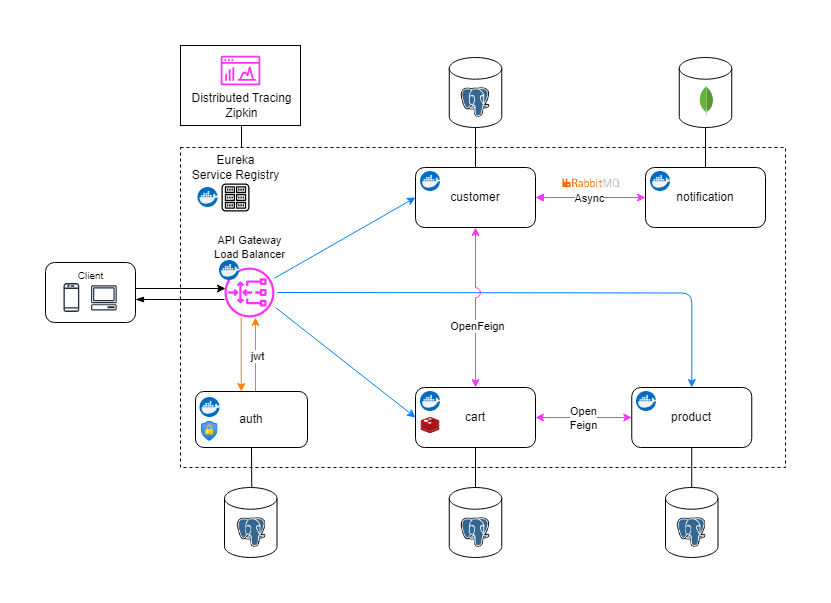
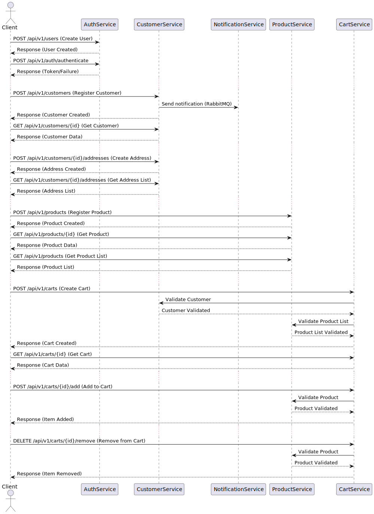

# 🛒 Shopping Cart Management - Microservices Architecture

The **Shopping Cart Management** is a distributed e-commerce cart management system in microservices architecture. The design emphasizes modularity, scalability, and performance while leveraging modern technologies and best practices. 🚀

It enables users to add, update, view, and delete items from their shopping carts. It integrates seamlessly with other services in the architecture, such as the Product and Notification Services, to provide real-time cart updates, product information, and asynchronous notifications.

---

## 🛠️ Architecture



1. **Service Registry (Eureka)**
   - Ensures service discovery for dynamic communication between microservices.

2. **API Gateway**
   - Routes external client requests to the requested services.
   - Acts as a centralized entry point for the entire system.

3. **Auth Service**  
   - Verifies and validates user authentication using JWT tokens.

4. **Customer Service**
   - Handles customer related operations (creation, details, validation).

5. **Cart Service**  
   - Handles shopping cart operations.

6. **Product Service**  
   - Provides product details and registration via `OpenFeign`.

7. **Notification Service**  
   - Sends notifications about customer registration asynchronously using **RabbitMQ**.

8. **Distributed Tracing (Zipkin)**  
   - Tracks requests across the distributed system for debugging and performance optimization.

---

## ⚙️ Technologies Used

- **Java 17 and Spring Boot 3** (Web, Validation, Data JPA, Cache, Security)
- **Spring Cloud** (Eureka, OpenFeign, Api Gateway/Load Balancer)  
- **Hibernate JCache and EhCache**  
- **RabbitMQ**  
- **PostgreSQL**  
- **Docker**  
- **Zipkin Tracing**  
- **Lombok and Mapstruct** 
- **jUnit + Mockito** 
- **Swagger + OpenApi** 

---

## 📚 Prerequisites

Before getting started, make sure you have the following installed and set up on your system:

- **JDK 17**: Ensure that you have Java Development Kit (JDK) 17 installed. JDK 17 is the required version for running and compiling the project. You can download it from the official [Oracle website](https://www.oracle.com/java/technologies/javase-jdk17-downloads.html) or use a package manager like Homebrew (macOS) or APT (Ubuntu).
- **Docker**: Docker is used to containerize the application for consistent environments across different systems. Install Docker by following the instructions on the [Docker website](https://www.docker.com/get-started).
- **IDE of choice or Maven**: You can use your preferred Integrated Development Environment (IDE) for Java development, such as IntelliJ IDEA, Eclipse, or Visual Studio Code with Java extensions. Alternatively, you can use Maven directly from the command line to manage dependencies, build the project, and run tests. To set up Maven, follow the installation guide on the [Apache Maven website](https://maven.apache.org/install.html).

---

## 🚀 How to Run

1. **Clone the Repository**  
   ```bash
   git clone https://github.com/adrianodpdiaz/shopping-cart-microservices.git
   cd shopping-cart-microservices
   ```

2. **Start Dependencies**  
   Launch MongoDB, PostgreSQL, RabbitMQ and Zipkin. You can use Docker Compose for ease of setup:
   ```bash
   docker-compose up -d
   ```

3. **Create a Password and Server on PostgreSQL**  
   PgAdmin is running by default on port 5050. Set up a password and create a server to contain the databases. 
   ```bash
   http://localhost:5050/
   ```

4. **Run Each Service**  
   Start each of the modules using Maven: `eureka-server`, `api-gateway`, `auth`, `customer`, `product`, `notification`, `cart`
   ```bash
   mvn spring-boot:run
   ```

5. **Access the Services**  
   All the service instances and ports will be available on Eureka (http://localhost:8761/).

| Method        | URL                       | Description                                                                                                   |
|---------------|---------------------------|---------------------------------------------------------------------------------------------------------------|
| Eureka        | `http://localhost:8761/`  | Service registry for microservices, providing service discovery and management.                               |
| PgAdmin       | `http://localhost:5050/`  | Web interface for managing PostgreSQL databases.                                                              |
| Mongo Express | `http://localhost:8081/`  | Web-based admin interface for managing MongoDB databases.                                                     |
| API Gateway   | `http://localhost:8084/`  | Gateway that routes requests to appropriate microservices, often including load balancing and authentication. |
| Zipkin        | `http://localhost:9411/`  | Distributed tracing tool for monitoring and debugging performance bottlenecks.                                |
| RabbitMQ      | `http://localhost:15672/` | Web-based management interface for RabbitMQ, for message queue management and monitoring.                     |

---

## 🔍 Request-Response Sequence and Endpoints



---
Made with ❤️ by [`Adriano Diaz`](https://www.linkedin.com/in/adriano-diaz/) :bird: